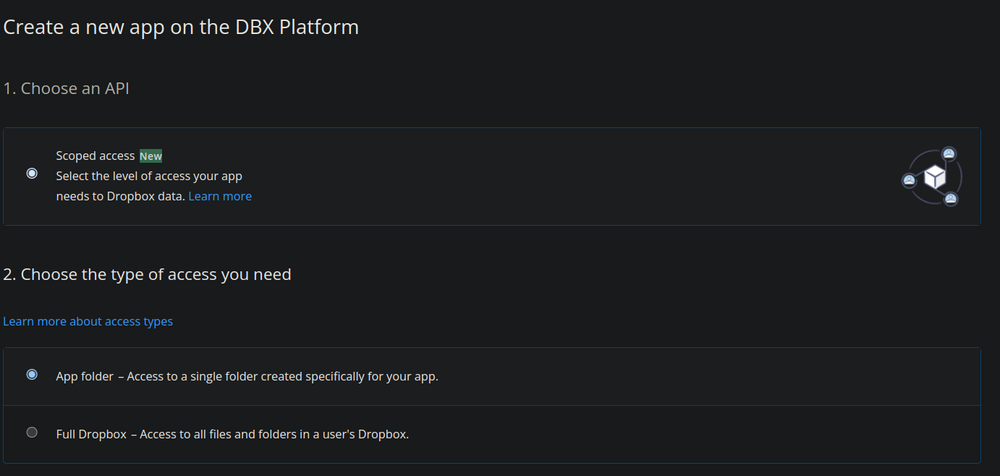
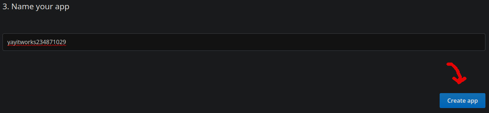
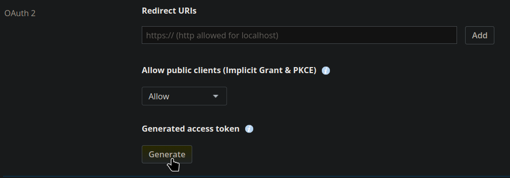
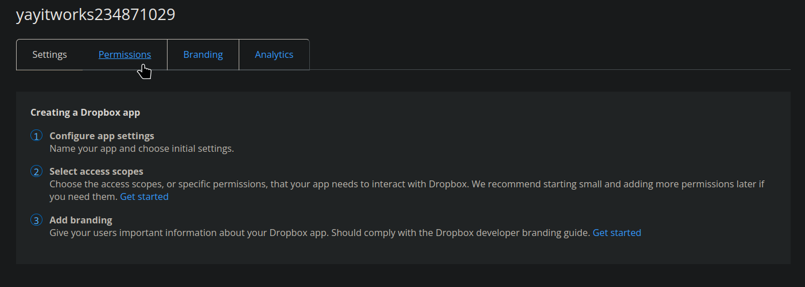
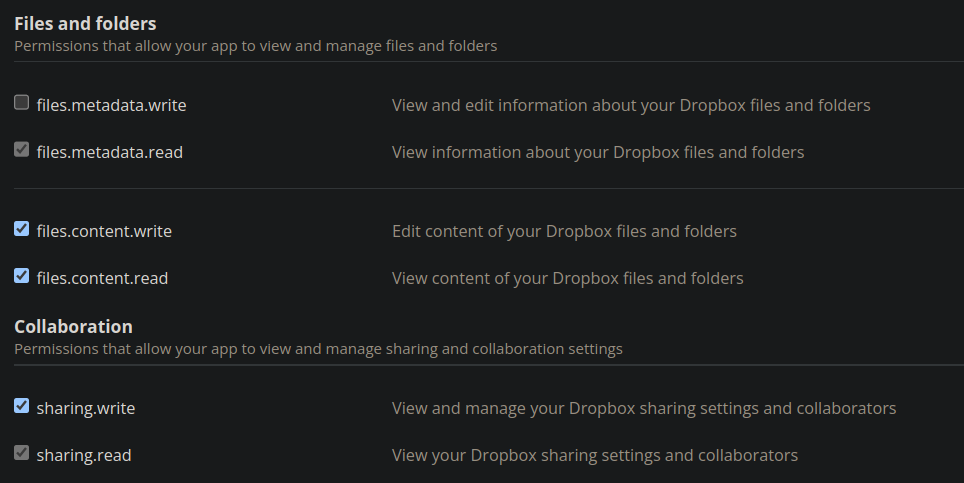
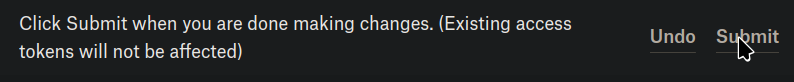

# Build a Godot Project without Mac!

Tools to develop apps for iOS without a Mac with Godot Engine!

Ever wanted to stop hopping between your Mac and Windows/Linux PCs when developing an iOS Project? This is the project for you!

Features:
- Editor to update IPA without rebuilding!
- Builder that pushes to GitHub actions for building!


> [!WARNING]
> This is in very early stages. Please report bugs and be cautious!

## Requirements
- gh CLI
- git

## Usage
1. [Download Python](https://python.org). Make sure to check the box that says "Add to PATH" if you're on Windows.
2. Go to the path where you downloaded this repository. 
   - For Windows, go to the folder and press on the address bar. Then, type in cmd and press enter.
   - For Linux, type `cd` and then the path you want in your terminal.
3. Install dependencies with the commands below. Choose the one for your operating system.

**Windows**
```shell
python -m venv venv
source venv/bin/activate
pip install -r requirements.txt
```

**Linux**
```shell
python3 -m venv venv
source venv/bin/activate
pip install -r requirements.txt
```
4. Visit https://www.dropbox.com/developers/apps to get your key.

You can name your app whatever you want, as long as it's unique.





5. Add `TOKEN=YOURKEYHERE` (replace the token with your token) in the file `.env`.

6. Run the Python script!
```shell
python main.py
```
7. (Optional) If you want to skip writing in the questions every time you want to build, add the answeres to the `.env` file. Make sure to check `example.env` for how to do this!

## Troubleshooting
If you get an `AuthError('expired_access_token', None))`, that means that you need to get a new OAuth token from Dropbox.

## Privacy Policy
- I don't collect any data from this project.
- This project uses GitHub and Dropbox. See the privacy policies for these services for more information.


## Notes and credits
- Started work on this project ~11/2024.
- Inspired by [u/_atreat](https://www.reddit.com/r/godot/comments/vlwrj0/comment/idxn5z8/) and [u/Host127001](https://www.reddit.com/r/godot/comments/s0pj02/comment/hs3rjl3/) who suggested building with Github actions.
