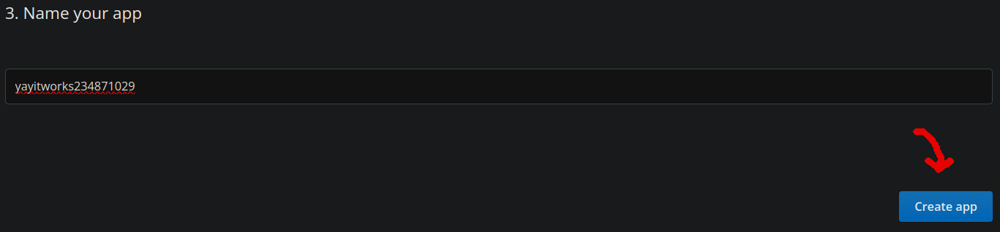

# Build a Godot Project without Mac!

Tools to develop apps for iOS without a Mac with Godot Engine!

Ever wanted to stop hopping between your Mac and Windows/Linux PCs when developing an iOS Project? This is the project for you!
See [my blog post](https://mak448a.github.io/blog/compile-ios-godot-without-mac) for more info!

Features:
- Editor to update the .ipa file of your game without rebuilding!
- Uploader that pushes your game to GitHub actions for building!


> [!WARNING]
> I try my best to write code that works, but I may have accidentally included bugs. Please report any that you find and be cautious!

## Requirements
- GitHub CLI (2.63.2 tested, other versions untested.)
- git
- Python (3.12+)

## Installation and Configuration
1. First, download [Python](Python.org/downloads), Git, and GitHub. Make sure to check the box that says "Add to PATH" when installing Python if you're on Windows. Run this command if you want to install Git and GitHub on Windows: `winget install Git.Git GitHub.cli`
3. Go to the path where you downloaded this repository. 
   - For Windows, go to the folder and press on the address bar. Then, type in cmd and press enter.
   - For Linux, type `cd` and then the path you want in your terminal.
4. Install dependencies with the commands below. Choose the one for your operating system.

**Windows**
```shell
python -m venv venv
venv\Scripts\activate
pip install -r requirements.txt
```

**Linux**
```shell
python3 -m venv venv
source venv/bin/activate
pip install -r requirements.txt
```
4. Visit https://www.dropbox.com/developers/apps to get your key.

You can name your app whatever you want, as long as it's unique.



5. Add `TOKEN=YOURKEYHERE` (replace the token with your token) in the file `.env`.

6. Run the Python script!
```shell
python main.py
```
7. (Optional) If you want to skip writing in the questions every time you want to build, add the answeres to the `.env` file. Make sure to check `example.env` for how to do this!

## Usage
When you launch the CLI with `python main.py`, it'll prompt you to choose whether you want to build or edit an IPA. For the first time, choose build IPA.

### Mode instructions
**Build IPA:**
- Follow the prompts.

**Edit IPA:**
- When exporting your Godot Project, choose "Export PCK/ZIP" and save it as `yourproject.pck`.

### But what's the difference?
- Build IPA is for the first time you run the CLI. It makes a fresh build of your project.
- Edit IPA is for afterwards. You can export with the PCK only, and it'll replace some of the files in the IPA. If you didn't change any settings in `project.godot`, it should work perfectly! If you did though, rebuild the IPA.


## Troubleshooting
If you get an `AuthError('expired_access_token', None))`, that means that you need to get a new OAuth token from Dropbox.
If you have any other problems, feel free to open an issue/discussion in this repository.

## Privacy Policy
- I don't collect any data from this project.
- This project uses GitHub and Dropbox. See the privacy policies for these services for more information.


## Notes and credits
- Edit IPA function inspired by [this article by RandomMomentania](https://randommomentania.com/2022/01/godot-easy-ios-app-testing/)
- Started work on this project ~11/2024.
- Inspired by [u/_atreat](https://www.reddit.com/r/godot/comments/vlwrj0/comment/idxn5z8/) and [u/Host127001](https://www.reddit.com/r/godot/comments/s0pj02/comment/hs3rjl3/) who suggested building with GitHub Actions.
